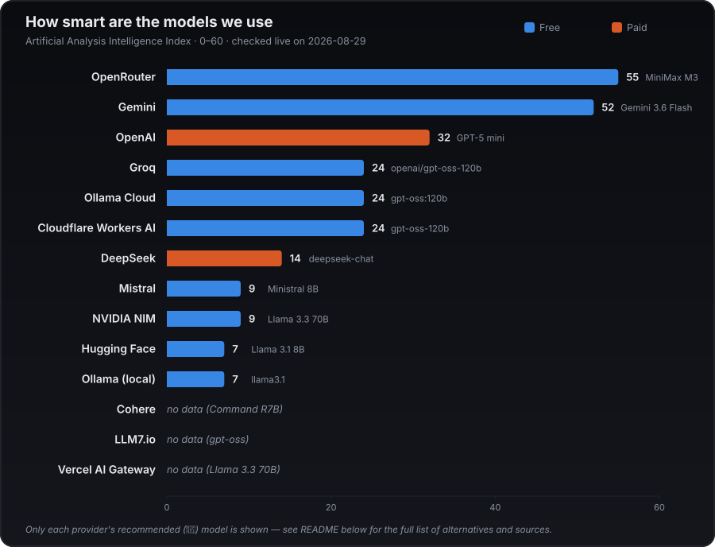

<div align="center">


### Automated job search & apply — LLM screening, a dashboard, and anti-ban pacing

[](https://github.com/deuteriumZzz/CrossJob-AI/actions/workflows/ci.yml)
[](LICENSE)
[](requirements.txt)
[](docs/GUIDE.md#сборка-в-exe-macos-и-windows)
[](docs/GUIDE.md)

[🇷🇺 Русский](README.md) · [🇬🇧 English](README.en.md)

</div>

---

> The setup guide ([docs/GUIDE.md](docs/GUIDE.md)) is Russian-only for now — this README covers the same ground in English, but for full setup detail you may need to translate that page.

**CrossJob-AI** searches for jobs across 8 platforms (Telegram channels
included), scores how well you fit each one, writes a personalized cover
letter with an LLM, and applies — either for real or in dry-run mode, so
you can check what the bot is about to send before it sends anything.

## Table of contents

- [What it does](#what-it-does)
- [What's new](#whats-new-2026-08-27)
- [Platforms](#platforms)
- [Chances of landing a job, by platform](#chances-of-landing-a-job-by-platform-based-on-2026-data)
- [Quick start](#quick-start)
- [Dashboard](#dashboard)
- [Limits & anti-ban](#limits--anti-ban)
- [Configuration](#configuration)
- [How smart are the models](#how-smart-are-the-models)
- [Development](#development)
- [License](#license)

## What it does

- 🔍 **Searches** for jobs matching your criteria (`work_preferences.yaml`) across connected platforms, Telegram channels included.
- ✍️ **Writes** a personalized cover letter for each vacancy with an LLM, based on your PDF resume (`data_folder/resume.pdf`) — the resume file itself is never rewritten.
- 🎯 **Scores fit**: before writing a letter or applying, an LLM scores 1-10 how well the resume fits the vacancy (threshold `JOB_SUITABILITY_SCORE`) — poorly matching vacancies are skipped without spending a real application.
- 🚀 **Applies** automatically or in dry-run mode (nothing actually sent) and keeps a history — including a readable HTML report with day/week/month stats, salary, and company website. History exports to TXT/PDF.
- 💬 **Messages first on Telegram**, where there's no "apply" button — a short greeting to the contact found in a post, then a full conversation in its own dashboard tab.
- 🛡️ **Protects the account from bans**: randomized pauses between applications, per-platform daily limits plus an optional shared total, `apply_once_at_company`.
- 🖥️ **Dashboard**: a native window with platform status, history, employer replies, and settings — no hand-editing YAML.

## What's new (2026-08-27)

- Telegram is no longer search-only: if a channel post contains exactly one unambiguous `@username` contact, the bot can message them a short greeting first (`telegram.auto_message`), with a human-like pause (2-10 minutes), a daily cap, and an active-hours window — not the whole cover letter, so it doesn't read as a mass mailing. The rest of the conversation lives in a new dashboard tab, **"Telegram" → "Conversations"** (per-contact message history, an unread badge, replying manually right from the dashboard); there's no auto-reply to incoming messages, by design. Posts older than `telegram.max_post_age_days` (7 by default) are skipped entirely, and channels can be given as a full link (`https://t.me/...`) as well as a bare username.
- Dashboard: a dedicated "Telegram" tab (channels, post freshness, auto-messaging, conversations) split out of the general "Search" panel — platforms and Telegram are now separate parts of the UI.
- Positions/locations can now be overridden per platform (Telegram included) without touching the shared list — empty on a platform means "use the shared list" (see `effective_list` in GUIDE.md).
- HeadHunter: handles one more application-questionnaire variant — a separate `/applicant/vacancy_response` page (previously only the same-page modal was recognized).
- A notification fires if not a single LLM call succeeded during a whole run (a sign of an exhausted free-tier limit) — vacancies still get scored via a fallback in that case, without a real LLM check.
- Dashboard: a "🎲 Distribute across platforms" button splits the total daily application limit across every platform with scheduling enabled, in random shares (LinkedIn gets half the weight of the rest); a new "Salary expectations" panel keeps HH (RUB/month) and LinkedIn (USD/year) as separate fields for their separate markets.
- Dashboard: a "🔍 Audit resume" button — a 3-step LLM chain (0-100 fit score + missing ATS keywords + red flags → a separate ATS-filter and "hiring manager" check → a rewritten experience section using the Google XYZ formula, grounded only in the real resume data, never invented years/roles). Cover letters (the plain-text version for HH/GetMatch/Wellfound/Himalayas and the extended PDF version) were rewritten around a more concrete structure: the biggest gap against the job posting is named outright instead of glossed over, and the closing gives one specific reason for wanting this particular company.
- Dashboard: "Resume & cover letter" is now its own sidebar tab (previously buried in Settings) — document generation (resume/tailored resume/letter) and the audit are visually split into separate cards instead of one row of buttons. The daemon's Start/Pause buttons merged into one (icon and label swap by state: Start → Pause → Resume) instead of three buttons side by side. A platform card now shows "Applications today X/Y" even in search-only mode — the counter used to disappear along with the limit.

## Platforms

| Platform       | Status                              |
|----------------|--------------------------------------|
| HeadHunter     | ✅ search + auto-apply (browser session, login via phone number + SMS — the official API requires HH app approval and isn't used; verified on a live account, see [GUIDE.md](docs/GUIDE.md) (RU)) |
| SuperJob       | ✅ search + auto-apply (official API) |
| Habr Career    | ✅ search + auto-apply (no usable official API for personal bots — manual login via Habr's SSO, including Google; for a logged-in user "Откликнуться" is an instant one-click submit, no form and no cover letter) — verified on a live account 2026-08-28 |
| geekjob        | ✅ search + auto-apply (scraping; manual OAuth login only — best-effort, not verified on a live account, see [GUIDE.md](docs/GUIDE.md) (RU)) |
| rabota.ru      | ✅ search + auto-apply (scraping; manual OAuth/code login only — best-effort, not verified on a live account, see [GUIDE.md](docs/GUIDE.md) (RU)) |
| GetMatch       | ✅ search + auto-apply (Next.js SPA — rendered via a real Selenium browser; login via a Telegram code, not a password) |
| Telegram channels | ✅ search + optional cold outreach to contacts found in posts (personal account via the official Telegram API; no auto-reply to incoming messages, see [GUIDE.md](docs/GUIDE.md) (RU)) |
| LinkedIn       | ✅ search (worldwide/by-country, remote only) + Easy Apply auto-apply (`undetected-chromedriver`, LLM answers screening questions in English) — verified on a live account 2026-08-23, see [GUIDE.md](docs/GUIDE.md) (RU) |
| Wellfound      | ✅ search (JSON-LD schema.org, verified against a live request 2026-09-02) + best-effort auto-apply through the Apply Now modal — NOT verified on a live logged-in account, see [GUIDE.md](docs/GUIDE.md) (RU) |
| Himalayas      | 🟡 experimental — search and auto-apply are implemented (`undetected-chromedriver`, same as LinkedIn), but NOT verified on a live account: anonymous access to /jobs and /companies/... is blocked by the site's anti-bot interstitial, see [GUIDE.md](docs/GUIDE.md) (RU) |
| careerspace.app| planned, low priority (confirmed: `/jobs` is a small personalized feed — no keyword search, no pagination; "Ссылка на отклик" requires login and where it leads is unconfirmed) |
| hirify.me      | planned (job aggregator, including Telegram channels) |

## Chances of landing a job, by platform (based on 2026 data)

The table above is about what the bot can technically do. This one is about the platform's actual market effectiveness — what candidates are saying about it right now and what public 2026 statistics show. These are rough estimates (every candidate's situation differs), but they help prioritize where to look first.

| Platform | Chance | Why |
|---|---|---|
| HeadHunter | 🟢 High | The largest database in Russia — 70M resumes, market leader ([Similarweb](https://www.similarweb.com/ru/website/hh.ru/competitors/), July 2026) |
| SuperJob | 🟢 High | ~29M monthly users (2025), a quality/active audience, strong in the public sector/manufacturing/education ([rb.ru](https://rb.ru/reviews/gde-iskat-rabotu-v-2026/)) |
| Habr Career | 🟢 High (for IT) | One of the clearest platforms specifically for IT job search, a mature ecosystem (company ratings, salaries, a journal) — now integrated into the bot, search and auto-apply verified on a live account |
| Telegram channels | 🟢 High (digital/marketing/sales) | Per HR-community data, over 60% of marketing specialists find jobs via Telegram rather than classic job sites — direct contact with HR, no middlemen ([vc.ru](https://vc.ru/hr___/2878466-luchshie-telegram-kanaly-dlya-udalyonnoy-rabotyi)) |
| GetMatch | 🟡 Medium-high (IT) | Open salaries, honest rules of the game, but an expensive platform for employers and high competition — averages ~92 applications per listing ([vc.ru](https://vc.ru/id5887884/2870166-saity-dlya-poiska-raboty-v-it)) |
| rabota.ru | 🟡 Medium | Reliable listings from stable companies, but there are complaints about stale postings and fewer interview invitations than on hh.ru ([otzovik.com](https://otzovik.com/reviews/rabota_ru-internet-servis_po_poisku_raboti_i_podboru_personala/)) |
| LinkedIn | 🟡 Medium | 87% of recruiters call LinkedIn the best tool for vetting candidates, but the response rate on direct applications is only 3-13% — 85% of actual hires close through networking/referrals, not job-posting applications ([Zippia](https://www.zippia.com/advice/linkedin-statistics/), [LinkedCraft](https://linkedcraft.io/blog/linkedin-networking-statistics-2026)) |
| Wellfound | 🟡 Medium (startups, English-speaking market) | Niche — early/growth-stage startups (YC and similar), not large corporate hiring; strong fit if the candidate specifically targets the startup scene ([Wellfound About](https://wellfound.com/about)) |
| Himalayas | 🟡 Medium (remote, English-speaking market) | Dedicated remote-only board, 200k+ job seekers claimed by the platform itself — less competition than LinkedIn, but also fewer listings |
| geekjob.ru | 🟡 Medium-low (IT) | A niche platform (averages 15-20 listings/month across classic IT tracks), HR experts are more skeptical of it than of hh.ru/Habr Career — useful as a secondary channel, not a primary one ([hrtime.ru](https://hrtime.ru/material/geekjob-ploshchadka-rabotaet-ili-net-59698/)) |

## Quick start

```bash
git clone https://github.com/deuteriumZzz/CrossJob-AI.git
cd CrossJob-AI
pip install -r requirements.txt
python main.py
```

On first run without a `data_folder/`, the bot offers to create one from
the template and asks for an LLM key (press Enter to skip and fill it in
later). The same result by hand:

```bash
cp -r data_folder_example data_folder
# fill in data_folder/secrets.yaml and data_folder/work_preferences.yaml
# place your resume as data_folder/resume.pdf
```

Full step-by-step detail (where to put your resume, what to fill in
`secrets.yaml`/`work_preferences.yaml`, what the bot does at each step) is
in [docs/GUIDE.md](docs/GUIDE.md) (Russian only).

Non-interactive run (for cron):

```bash
python main.py --auto headhunter   # or superjob / geekjob / rabota_ru / telegram / getmatch / linkedin / habr_career / wellfound / himalayas
python main.py --auto all          # all platforms in sequence, with pauses
```

Instead of external cron — the built-in scheduler:

```bash
python main.py --daemon
```

## Dashboard

Instead of raw CLI/cron — a desktop app with a web dashboard in a native window:

```bash
pip install -r requirements-desktop.txt
python desktop_app.py
```

Platform status, application history, employer replies, Telegram
conversations, and every setting — all in one window, no hand-editing
YAML. The dashboard can also handle first-time setup from scratch (its
own web wizard, no `data_folder/` needed beforehand), plus targeted
changes without restarting:

- edit positions/locations/blacklists, including a "Generate positions from resume" button (the LLM suggests 2-4 matching positions from your PDF resume);
- configure Telegram on its own tab — channels, auto-messaging, conversations;
- distribute the daily application limit across platforms with one button ("🎲");
- set salary expectations separately for HH (₽/month) and LinkedIn ($/year);
- rebuild `plain_text_resume.yaml` from the PDF, export `applied_log.json` as a backup;
- get a Telegram notification when daily LLM spend crosses a threshold (or when every LLM provider is unavailable);
- switch the LLM provider/model (OpenAI/Groq/Gemini/DeepSeek/NVIDIA NIM/OpenRouter/Mistral/Cohere/Hugging Face/Ollama Cloud/LLM7.io/Cloudflare/Vercel/Ollama) with your own API key for each — no `config.py` editing.

The same server can be run directly and opened in a regular browser:
`uvicorn src.webui.api:app --reload` (listens on `127.0.0.1` only).
Building a standalone `.app`/`.exe` — see [GUIDE.md](docs/GUIDE.md#сборка-в-exe-macos-и-windows) (RU).

## Limits & anti-ban

The daily limit and per-run limit are **our own** settings (pacing, so the account doesn't look like a bot) — not official platform numbers, which are either undocumented publicly or don't apply (geekjob/rabota.ru/GetMatch have no official API at all, only scraping; Telegram is a personal account, not an API integration with platform-side limits).

The values below are defaults from `config.py`, changed on the fly in the dashboard (**Settings → Application Limits**) without restarting or editing code.

| Platform | Daily application limit | Per run | Platform's official limit |
|----------|------------------------|-----------------|------------------------------|
| HeadHunter | `DAILY_APPLICATION_LIMIT` = 15 (±random 70-100%) | `JOB_MAX_APPLICATIONS` = 5 | Not publicly documented (429 if exceeded) |
| SuperJob | 15 (±70-100%) | 5 | Not publicly documented |
| geekjob.ru | No daily limit of its own — `job_max_applications` per run | 5 | No official API — 24h cooldown on captcha/ban signs |
| rabota.ru | No daily limit of its own — `job_max_applications` per run | 5 | No official API — same cooldown |
| GetMatch | No daily limit of its own — `job_max_applications` per run | 5 | No official API — same cooldown |
| Telegram channels | `telegram.daily_message_limit` = 15 cold messages/day | `messages_per_channel` = 100 messages per channel per run | Personal account, not an API integration — no platform limit |
| LinkedIn | `LINKEDIN_DAILY_APPLICATION_LIMIT` = 8 (±70-100%) | 5 | No official API — automation is against ToS, see the caveat in [GUIDE.md](docs/GUIDE.md) (RU) |
| Wellfound | Shared `DAILY_APPLICATION_LIMIT` (unless overridden in the `wellfound:` block) | 5 | No official API — 24h cooldown on captcha/ban signals |
| Himalayas | Shared `DAILY_APPLICATION_LIMIT` (unless overridden in the `himalayas:` block) | 5 | No official API — same cooldown; the site also shows an anti-bot interstitial on suspicious traffic |

Plus an optional `apply_once_at_company` (never apply to the same company twice) and an optional `limits.total_daily_application_limit` — a hard ceiling across all platforms at once. More on anti-ban pacing in [GUIDE.md](docs/GUIDE.md) (RU).

## Configuration

- **`data_folder/secrets.yaml`** — your LLM key (`llm_api_key`, defaults to OpenAI) and, for each platform, its own keys (HeadHunter needs no secrets — login is browser-based; SuperJob — https://api.superjob.ru/register/, Telegram — https://my.telegram.org/apps). The LLM provider doesn't have to be OpenAI — 12 providers are supported, each with its own key under `llm_api_keys:` (switching provider and entering keys — in the dashboard, no `config.py` editing). **Default recommendation — Groq, model `openai/gpt-oss-120b`** (👑 in the model picker): free, and good enough for scoring vacancies/writing letters.
- **`data_folder/work_preferences.yaml`** — positions, locations, company/title/location blacklists, filters by experience/employment type/date, and optional per-platform blocks (`auto_apply`, `resume_id`, `schedule_enabled`/`interval_hours`) plus a `telegram:` block (`channels`, `auto_message`, `daily_message_limit`, `max_post_age_days`). Any platform can override `positions`/`locations` just for itself inside its own block — empty there means "use the shared list above".
- **`data_folder/resume.pdf`** — your resume as-is; used only to generate cover letters and score fit.

The first run of each platform's action opens a browser for a one-time login; the session/token refreshes automatically after that. The full field-by-field reference is in [GUIDE.md](docs/GUIDE.md) (RU).

## How smart are the models

Every provider in the project has a default model (👑 in the dashboard's model picker) — here's how they compare on an independent benchmark, [Artificial Analysis Intelligence Index](https://artificialanalysis.ai/leaderboards/models), checked live on 2026-08-29. This is a snapshot — providers update models and weights without notice, so the exact numbers will drift, but the relative spread — which model is clearly smarter vs. simpler — still holds as a guide.



## Development

```bash
pip install -r requirements.txt -r requirements-desktop.txt
black --line-length 79 --check .
isort --profile black --line-length 79 --check .
flake8 --max-line-length=79 --select=E,F --extend-ignore=E704
mypy --ignore-missing-imports main.py src desktop_app.py
python -m pytest tests/ -q
```

The same checks run in CI on every push/PR to `main` (see [ci.yml](.github/workflows/ci.yml)). Project layout: `main.py`/`desktop_app.py` are the entry points, `src/job_sources/` has one module per platform plus shared logic (LLM, anti-ban, applications, history), `src/webui/` is the FastAPI dashboard, `src/libs/resume_and_cover_builder/` generates resume/cover-letter PDFs, `tests/` holds the unit tests.

## License

[PolyForm Noncommercial 1.0.0](LICENSE) — Dmitry Vologdin, 2026. Use, modification, and forks are permitted for any noncommercial purpose; embedding this in a commercial product or paid service is not.
