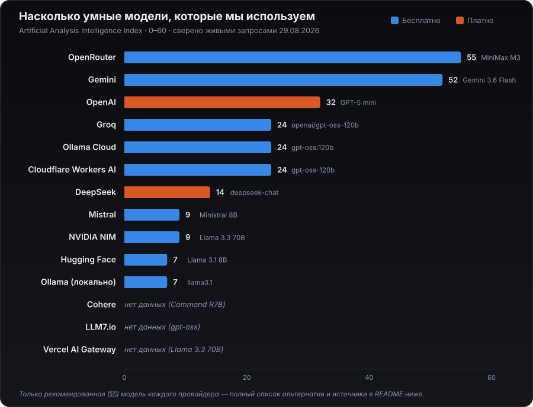

<div align="center">


### Автопоиск и автоотклик на вакансии — с LLM-подбором, дашбордом и анти-бан пацингом

[](https://github.com/deuteriumZzz/CrossJob-AI/actions/workflows/ci.yml)
[](LICENSE)
[](requirements.txt)
[](docs/GUIDE.md#сборка-в-exe-macos-и-windows)
[](docs/GUIDE.md)

[🇷🇺 Русский](README.md) · [🇬🇧 English](README.en.md)

</div>

---

**CrossJob-AI** ищет вакансии на 8 площадках (включая Telegram-каналы), сам оценивает,
насколько вы подходите, пишет персональное сопроводительное письмо под каждую
вакансию с помощью LLM и откликается — либо по-настоящему, либо в режиме
dry-run, чтобы сначала проверить, что бот вообще собирается отправить.

## Содержание

- [Что делает](#что-делает)
- [Площадки](#площадки)
- [Шанс найти работу по площадкам](#шанс-найти-работу-по-площадкам-по-данным-на-2026-год)
- [Быстрый старт](#быстрый-старт)
- [Дашборд](#дашборд)
- [Лимиты и анти-бан](#лимиты-и-анти-бан)
- [Конфигурация](#конфигурация)
- [Насколько умные модели](#насколько-умные-модели)
- [Разработка](#разработка)
- [Лицензия](#лицензия)

## Что делает

- 🔍 **Ищет** вакансии по вашим критериям (`work_preferences.yaml`) на подключённых площадках, включая Telegram-каналы; если у одной вакансии не загрузилась страница — пропускается конкретная вакансия, а не весь прогон площадки.
- ✍️ **Пишет** персональное сопроводительное письмо под каждую вакансию с помощью LLM, на основе вашего PDF-резюме (`data_folder/resume.pdf`) — само резюме не переписывается. Кроме чёрного списка слов-шаблонов есть структурные проверки против типичных признаков "AI-текста" (эм-даш как соединитель, "не только X, но и Y", принудительные трёхсписки и т.п.) — подключены и здесь, и в ответах работодателю в чате HH, и в генерации/переписывании резюме.
- 🎯 **Оценивает соответствие**: перед письмом/откликом LLM ставит балл 1-10, насколько резюме подходит вакансии (порог `JOB_SUITABILITY_SCORE`) — плохо подходящие вакансии пропускаются, не тратя реальный отклик.
- 🚀 **Откликается** автоматически или в режиме dry-run (без реальной отправки) и ведёт историю — включая читаемый HTML-отчёт со статистикой за день/неделю/месяц, зарплатой и сайтом компании. Экспорт истории в TXT/PDF.
- 💬 **Пишет первым в Telegram**, где нет кнопки "откликнуться": короткое приветствие найденному в посте контакту, а дальше — переписка в отдельной вкладке дашборда.
- 🛡️ **Защищается от бана**: случайные паузы между откликами, суточные лимиты на площадку и опциональный общий лимит на все площадки сразу, `apply_once_at_company`.
- 🖥️ **Дашборд**: нативное окно с обзором площадок, историей, ответами работодателей и настройками — без правки YAML руками.

## Площадки

| Площадка       | Статус                              |
|----------------|--------------------------------------|
| HeadHunter     | ✅ поиск + автоотклик (браузерная сессия, вход по номеру телефона + SMS — официальный API требует одобрения приложения HH, не используется; сверено на живом аккаунте, см. [GUIDE.md](docs/GUIDE.md)); проверка статуса отклика распознаёт и отдельную страницу формы `/applicant/vacancy_response`, не только модалку на странице вакансии |
| Хабр Карьера   | ✅ поиск + автоотклик (официального API для личных ботов нет — вход вручную через SSO Хабра, включая Google; для вошедшего пользователя "Откликнуться" — мгновенная отправка одним кликом, без формы и без письма) — сверено на живом аккаунте 2026-08-28 |
| geekjob        | ✅ поиск + автоотклик (браузерная сессия; вход только вручную через OAuth — best-effort, не сверено на живом аккаунте, см. [GUIDE.md](docs/GUIDE.md)) |
| GetMatch       | ✅ поиск + автоотклик (браузерная сессия на Next.js-SPA; вход по коду из Telegram, не по паролю) |
| Telegram-каналы| ✅ поиск + опциональные автосообщения контактам из постов (личный аккаунт через официальный API Telegram; автоответа на входящие нет, см. [GUIDE.md](docs/GUIDE.md)) |
| LinkedIn       | ✅ поиск (worldwide/по странам, только remote) + автоотклик Easy Apply (браузерная сессия + undetected-chromedriver, LLM отвечает на вопросы анкеты по-английски) — сверено на живом аккаунте 2026-08-23, см. [GUIDE.md](docs/GUIDE.md) |
| Wellfound      | ✅ поиск (JSON-LD schema.org, сверено на живом запросе 2026-09-02) + best-effort автоотклик через модалку Apply Now — НЕ подтверждён на живом залогиненном аккаунте, см. [GUIDE.md](docs/GUIDE.md) |
| Himalayas      | 🟡 experimental — поиск и автоотклик реализованы (браузерная сессия + undetected-chromedriver, как LinkedIn), но НЕ сверены на живом аккаунте: анонимный доступ к /jobs и /companies/... блокируется анти-бот интерстишлом сайта, см. [GUIDE.md](docs/GUIDE.md) |

## Шанс найти работу по площадкам (по данным на 2026 год)

Таблица выше — про то, что умеет бот технически. Эта — про рыночную эффективность самой площадки: что о ней сейчас пишут кандидаты и что показывает открытая статистика 2026 года. Оценка приблизительная (ситуация у каждого кандидата своя), но помогает расставить приоритет, куда смотреть в первую очередь.

| Площадка | Шанс | Почему |
|---|---|---|
| HeadHunter | 🟢 Высокий | Крупнейшая база в РФ — 70 млн резюме, лидер рынка ([Similarweb](https://www.similarweb.com/ru/website/hh.ru/competitors/), июль 2026) |
| Хабр Карьера | 🟢 Высокий (для IT) | Одна из самых понятных площадок именно для IT-поиска, зрелая экосистема (рейтинг компаний, зарплаты, журнал) — теперь подключена к боту, поиск и автоотклик подтверждены на живом аккаунте |
| Telegram-каналы | 🟢 Высокий (digital/маркетинг/продажи) | По данным HR-сообщества больше 60% специалистов в маркетинге находят работу через Telegram, а не классические сайты — прямой контакт с HR без посредников ([vc.ru](https://vc.ru/hr___/2878466-luchshie-telegram-kanaly-dlya-udalyonnoy-rabotyi)) |
| GetMatch | 🟡 Средний-высокий (IT) | Открытые зарплаты, честные правила игры, но дорогая площадка для работодателей и высокая конкуренция — в среднем ~92 отклика на вакансию ([vc.ru](https://vc.ru/id5887884/2870166-saity-dlya-poiska-raboty-v-it)) |
| LinkedIn | 🟡 Средний | 87% рекрутеров считают LinkedIn лучшим инструментом для оценки кандидатов, но отклик на прямые заявки — всего 3-13%: 85% реальных найма закрывается через нетворкинг/рефералов, а не через отклики на вакансии ([Zippia](https://www.zippia.com/advice/linkedin-statistics/), [LinkedCraft](https://linkedcraft.io/blog/linkedin-networking-statistics-2026)) |
| geekjob.ru | 🟡 Средний-низкий (IT) | Нишевая площадка (в среднем 15-20 вакансий/мес по классическим IT-направлениям), HR-эксперты относятся скептичнее, чем к hh.ru/Хабр Карьере — полезна как дополнительный канал, не основной ([hrtime.ru](https://hrtime.ru/material/geekjob-ploshchadka-rabotaet-ili-net-59698/)) |
| Wellfound | 🟡 Средний (стартапы, англоязычный рынок) | Ниша — ранние/growth-stage стартапы (YC-компании и похожие), а не крупный корпоративный найм; сильна там, где кандидат целится именно в стартап-среду ([Wellfound о себе](https://wellfound.com/about)) |
| Himalayas | 🟡 Средний (remote, англоязычный рынок) | Специализированная remote-only площадка, 200k+ соискателей заявлено самой платформой — меньше конкуренции, чем на LinkedIn, но и меньше объём вакансий |

## Быстрый старт

```bash
git clone https://github.com/deuteriumZzz/CrossJob-AI.git
cd CrossJob-AI
pip install -r requirements.txt
python main.py
```

При первом запуске без `data_folder/` бот сам предложит создать его из
шаблона и попросит ключ LLM (Enter — чтобы пропустить и вписать позже).
Тот же результат руками:

```bash
cp -r data_folder_example data_folder
# заполните data_folder/secrets.yaml и data_folder/work_preferences.yaml
# положите своё резюме как data_folder/resume.pdf
```

Дальше — по шагам в [полном гайде](docs/GUIDE.md): куда класть резюме, что писать в `secrets.yaml`/`work_preferences.yaml`, что бот делает на каждом шаге.

Неинтерактивный запуск (для cron):

```bash
python main.py --auto headhunter   # или geekjob / getmatch / telegram / linkedin / habr_career / wellfound / himalayas
python main.py --auto all          # все площадки по очереди, с паузами
```

Вместо cron — встроенный планировщик:

```bash
python main.py --daemon
```

## Дашборд

Вместо голого CLI/cron — десктоп-приложение с веб-дашбордом в нативном окне:

```bash
pip install -r requirements-desktop.txt
python desktop_app.py
```

Статус площадок, история откликов, ответы работодателей, диалоги в
Telegram и все настройки — в одном окне, без ручной правки YAML.
Дашборд умеет и первоначальную настройку с нуля (свой веб-мастер, без
предварительно созданного `data_folder/`), и точечные действия без
перезапуска:

- редактировать должности/локации/чёрные списки, включая кнопку "Сгенерировать должности из резюме" (LLM сам предложит 2-4 подходящие должности по PDF-резюме);
- проверить резюме кнопкой "Проверить" — процент соответствия вакансии с цветным индикатором, бэйдж "пройдёт/не пройдёт ATS", решение нанимающего менеджера (да/возможно/нет), отсутствующие ключевые слова и сильные/слабые разделы списками, вместо трёх абзацев сырого текста от LLM;
- посмотреть логи во вкладке "Логи" — читаются из файла (`log/app.log`, включён по умолчанию), а не только из памяти текущего запуска;
- настраивать Telegram отдельно — каналы, автосообщения, диалоги;
- распределять дневной лимит откликов по площадкам одной кнопкой ("🎲");
- задавать ожидания по зарплате отдельно для HH (₽/мес) и LinkedIn ($/год);
- пересобрать `plain_text_resume.yaml` из PDF, экспортировать `applied_log.json` как бэкап;
- получить уведомление в Telegram, когда дневные траты на LLM превысят порог (или когда все провайдеры LLM недоступны);
- переключить провайдера/модель LLM (OpenAI/Groq/Gemini/DeepSeek/NVIDIA NIM/OpenRouter/Mistral/Cohere/Hugging Face/Ollama Cloud/LLM7.io/Cloudflare/Vercel/Ollama) со своим API-ключом на каждого — без правки `config.py`.

Тот же сервер можно поднять напрямую и открыть в обычном браузере:
`uvicorn src.webui.api:app --reload` (слушает только `127.0.0.1`).

**Готовый упакованный .app/.exe** (для macOS и Windows) — скачайте с [GitHub Releases](https://github.com/deuteriumZzz/CrossJob-AI/releases) (когда релизы появятся) или соберите сами — см. [GUIDE.md](docs/GUIDE.md#сборка-в-exe-macos-и-windows) и [GUIDE.md](docs/GUIDE.md#как-запустить-упакованное-приложение).

## Лимиты и анти-бан

Дневной лимит и лимит за один прогон — это **наши собственные** настройки (пацинг, чтобы не выглядеть ботом), не официальные цифры площадок — они либо нигде публично не задокументированы, либо неприменимы (у geekjob/GetMatch нет официального API вообще, только браузерная сессия; у Telegram — это личный аккаунт, а не API-интеграция с лимитами площадки).

Значения ниже — дефолты из `config.py`, меняются на ходу в дашборде (**Настройки → Лимиты откликов**) без перезапуска и правки кода. Каждый прогон пишет в лог сводку воронки по каждой площадке (найдено / уже видели / отсеялось по оценке / откликнулись / только просмотр) — помогает понять, по какой причине не набирается дневной лимит.

| Площадка | Дневной лимит откликов | За один прогон | Защита |
|----------|------------------------|-----------------|-----|
| HeadHunter | `DAILY_APPLICATION_LIMIT` = 15 (±случайные 70-100%) | `JOB_MAX_APPLICATIONS` = 5 | Не задокументирован публично (429 при превышении) |
| geekjob.ru | Своего дневного лимита нет — `job_max_applications` за прогон | 5 | Кулдаун 24ч при признаках капчи/бана |
| GetMatch | Своего дневного лимита нет — `job_max_applications` за прогон | 5 | Кулдаун 24ч при признаках капчи/бана |
| Telegram-каналы | `telegram.daily_message_limit` = 15 холодных сообщений/день | `messages_per_channel` = 100 сообщений на канал за прогон | Личный аккаунт, не API-интеграция — лимитов площадки нет |
| LinkedIn | `LINKEDIN_DAILY_APPLICATION_LIMIT` = 8 (±70-100%) | 5 | Официального API нет — автоматизация против ToS, см. оговорку в [GUIDE.md](docs/GUIDE.md) |
| Wellfound | Общий `DAILY_APPLICATION_LIMIT` (если не задан свой в блоке `wellfound:`) | 5 | Кулдаун 24ч при признаках капчи/бана |
| Himalayas | Общий `DAILY_APPLICATION_LIMIT` (если не задан свой в блоке `himalayas:`) | 5 | Кулдаун 24ч; сайт также показывает анти-бот интерстишл при подозрительном трафике |
| Хабр Карьера | Общий `DAILY_APPLICATION_LIMIT` (если не задан свой в блоке `habr_career:`) | 5 | Кулдаун 24ч при признаках капчи/бана |

Плюс `apply_once_at_company` (опционально — не откликаться в одну компанию дважды) и опциональный `limits.total_daily_application_limit` — жёсткий потолок на все площадки сразу. Подробнее про анти-бан пацинг — в [GUIDE.md](docs/GUIDE.md).

## Конфигурация

- **`data_folder/secrets.yaml`** — ключ LLM (`llm_api_key`, по умолчанию для OpenAI) и, для каждой площадки, свои ключи (HeadHunter/Хабр Карьера/GetMatch/Telegram — вход браузерный, секретов не требует; Telegram требует личного приложения на https://my.telegram.org/apps). Провайдер LLM не обязан быть OpenAI — поддерживаются 14 провайдеров, каждый со своим ключом в `llm_api_keys:` (переключение и ввод ключей — в дашборде, без правки `config.py`). **Рекомендация по умолчанию — Groq, модель `openai/gpt-oss-120b`** (👑 в выборе модели): бесплатно и достаточно для оценки вакансий/писем.
- **`data_folder/work_preferences.yaml`** — позиции, локации, чёрные списки компаний/названий/локаций, фильтры по опыту/типу занятости/дате, и опциональные блоки на площадку (`auto_apply`, `schedule_enabled`/`interval_hours`) и `telegram:` (`channels`, `auto_message`, `daily_message_limit`, `max_post_age_days`). Любую площадку можно точечно переопределить своими `positions`/`locations` внутри её блока — пусто там означает "используй общий список сверху".
- **`data_folder/resume.pdf`** — резюме как есть; используется только для генерации сопроводительных писем и оценки соответствия.

Первый запуск действия по каждой площадке откроет браузер для одноразового входа; дальше сессия/токен обновляется автоматически. Полное описание каждого поля — в [GUIDE.md](docs/GUIDE.md).

## Насколько умные модели

Для каждого провайдера в проекте есть модель по умолчанию (👑 в выборе модели дашборда) — вот как они соотносятся по независимому бенчмарку [Artificial Analysis Intelligence Index](https://artificialanalysis.ai/leaderboards/models), сверенному живыми запросами 29.08.2026. Это снимок на конкретный момент — сами модели и веса провайдеры обновляют без предупреждения, поэтому абсолютные цифры со временем устареют, но относительный разброс — какая модель заметно умнее, а какая проще — ориентир и так.



## Разработка

```bash
pip install -r requirements.txt -r requirements-desktop.txt
black --line-length 79 --check .
isort --profile black --line-length 79 --check .
flake8 --max-line-length=79 --select=E,F --extend-ignore=E704
mypy --ignore-missing-imports main.py src desktop_app.py
python -m pytest tests/ -q
```

Тот же набор проверок гоняется в CI на каждый push/PR в `main` (см. [ci.yml](.github/workflows/ci.yml)). Структура проекта: `main.py`/`desktop_app.py` — точки входа, `src/job_sources/` — по модулю на площадку плюс общая логика (LLM, анти-бан, отклики, история), `src/webui/` — FastAPI-дашборд, `src/libs/resume_and_cover_builder/` — генерация PDF резюме/писем, `tests/` — юнит-тесты.

## Лицензия

[MIT](LICENSE) — Dmitry Vologdin, 2026.
